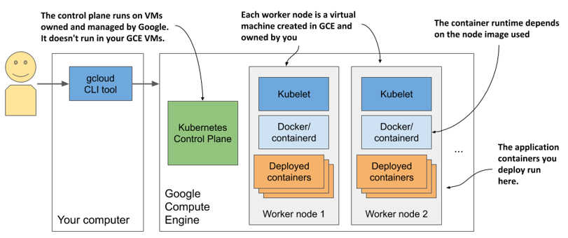

# 3.1.4   Creating a managed cluster with Google Kubernetes Engine
If you want to use a full-fledged multi-node Kubernetes cluster instead of a local one, you can use a managed cluster, such as the one provided by Google Kubernetes Engine (GKE). This way, you don’t have to manually set up all the cluster nodes and networking, which is usually too hard for someone taking their first steps with Kubernetes. Using a managed solution such as GKE ensures that you don’t end up with an incorrectly configured cluster.

## Setting up Google Cloud and installing the gcloud client binary
Before you can set up a new Kubernetes cluster, you must set up your GKE environment. The process may change in the future, so I’ll only give you a few general instructions here. For complete instructions, refer to https://cloud.google.com/container-engine/docs/before-you-begin.

Roughly, the whole procedure includes

1. Signing up for a Google account if you don’t have one already.
2. Creating a project in the Google Cloud Platform Console.
3. Enabling billing. This does require your credit card info, but Google provides a 12-month free trial with a free $300 credit. And they don’t start charging automatically after the free trial is over.
4. Downloading and installing the Google Cloud SDK, which includes the gcloud tool.
5. Creating the cluster using the gcloud command-line tool.


NOTE

Certain operations (the one in step 2, for example) may take a few minutes to complete, so relax and grab a coffee in the meantime.



## Creating a GKE Kubernetes cluster with three nodes
Before you create your cluster, you must decide in which geographical region and zone it should be created. Refer to https://cloud.google.com/compute/docs/regions-zones to see the list of available locations. In the following examples, I use the europe-west3 region based in Frankfurt, Germany. It has three different zones - I’ll use the zone europe-west3-c. The default zone for all gcloud operations can be set with the following command:
`$ gcloud config set compute/zone europe-west3-c`

Create the Kubernetes cluster using the command shown in the next listing. You can choose a name other than kubia if you wish.

```
Listing 3.7 Creating a three-node cluster in GKE
$ gcloud container clusters create kubia --num-nodes 3
Creating cluster kubia in europe-west3-c...
...
kubeconfig entry generated for kubia.
NAME   LOCAT.   MASTER_VER  MASTER_IP   MACH_TYPE     ... NODES STATUS
kubia  eu-w3-c  1.13.11...  5.24.21.22  n1-standard-1 ... 3     RUNNING
```


NOTE

I’m creating all three worker nodes in the same zone, but you can also spread them across all zones in the region by setting the compute/zone config value to an entire region instead of a single zone. If you do so, note that --num-nodes indicates the number of nodes per zone. If the region contains three zones and you only want three nodes, you must set --num-nodes to 1.


You should now have a running Kubernetes cluster with three worker nodes. Each node is a virtual machine provided by the Google Compute Engine (GCE) infrastructure-as-a-service platform. You can list GCE virtual machines using the command in the next listing.

```
Listing 3.8 Listing GCE virtual machines
$ gcloud compute instances list
NAME      ZONE        MACHINE_TYPE   INTERNAL_IP  EXTERNAL_IP     STATUS
...-ctlk  eu-west3-c  n1-standard-1  10.156.0.16  34.89.238.55    RUNNING
...-gj1f  eu-west3-c  n1-standard-1  10.156.0.14  35.242.223.97   RUNNING
...-r01z  eu-west3-c  n1-standard-1  10.156.0.15  35.198.191.189  RUNNING
```


TIP

  Each VM incurs costs. To reduce the cost of your cluster, you can reduce the number of nodes to one, or even to zero while not using it. See next section for details.


The system is shown in the next figure. Note that only your worker nodes run in GCE virtual machines. The control plane runs elsewhere - you can’t access the machines hosting it.
Figure 3.5 Your Kubernetes cluster in Google Kubernetes Engine


## Scaling the number of nodes
Google allows you to easily increase or decrease the number of nodes in your cluster. For most exercises in this book you can scale it down to just one node if you want to save money. You can even scale it down to zero so that your cluster doesn’t incur any costs.

To scale the cluster to zero, use the following command:
`$ gcloud container clusters resize kubia --size 0`

The nice thing about scaling to zero is that none of the objects you create in your Kubernetes cluster, including the applications you deploy, are deleted. Granted, if you scale down to zero, the applications will have no nodes to run on, so they won’t run. But as soon as you scale the cluster back up, they will be redeployed. And even with no worker nodes you can still interact with the Kubernetes API (you can create, update, and delete objects).

## Inspecting a GKE worker node
If you’re interested in what’s running on your nodes, you can log into them with the following command (use one of the node names from the output of the previous command):
`$ gcloud compute ssh gke-kubia-default-pool-9bba9b18-4glf`

While logged into the node, you can try to list all running containers with docker ps. You haven’t run any applications yet, so you’ll only see Kubernetes system containers. What they are isn’t important right now, but you’ll learn about them in later chapters.

