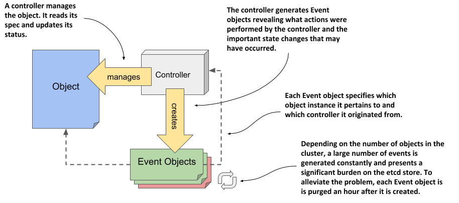

# Observing cluster events via Event objects
As controllers perform their task of reconciling the actual state of an object with the desired state, as specified in the object’s `spec` field, they generate events to reveal what they have done. Two types of events exist: Normal and Warning. Events of the latter type are usually generated by controllers when something prevents them from reconciling the object. By monitoring this type of events, you can be quickly informed of any problems that the cluster encounters.

## Introducing the Event object
Like everything else in Kubernetes, events are represented by Event objects that are created and read via the Kubernetes API. As the following figure shows, they contain information about what happened to the object and what the source of the event was. Unlike other objects, each Event object is deleted one hour after its creation to reduce the burden on etcd, the data store for Kubernetes API objects.

Figure 4.7 The relationship between Event objects, controllers, and other API objects.




NOTE

The amount of time to retain events is configurable via the API server’s command-line options.



### Listing events using kubectl get events
The events displayed by `kubectl describe` refer to the object you specify as the argument to the command. Due to their nature and the fact that many events can be created for an object in a short time, they aren’t part of the object itself. You won’t find them in the object’s YAML manifest, as they exist on their own, just like Nodes and the other objects you’ve seen so far.


NOTE

If you want to follow the exercises in this section in your own cluster, you may need to restart one of the nodes to ensure that the events are recent enough to still be present in etcd. If you can’t do this, don’t worry, and just skip doing these exercises yourself, as you’ll also be generating and inspecting events in the exercises in the next chapter.


Because Events are standalone objects, you can list them using `kubectl get events`, as shown in the next listing.

```shell
Listing 4.7 Listing events using kubectl get events
$ kubectl get ev
LAST
SEEN  TYPE    REASON                   OBJECT             MESSAGE
48s   Normal  Starting                 node/kind-worker2  Starting kubelet.
48s   Normal  NodeAllocatableEnforced  node/kind-worker2  Updated Node A...
48s   Normal  NodeHasSufficientMemory  node/kind-worker2  Node kind-work...
48s   Normal  NodeHasNoDiskPressure    node/kind-worker2  Node kind-work...
48s   Normal  NodeHasSufficientPID     node/kind-worker2  Node kind-work...
47s   Normal  Starting                 node/kind-worker2  Starting kube-...
```


NOTE

The previous listing uses the short name `ev` in place of `events`.


You’ll notice that some events displayed in the listing match the status conditions of the Node. This is often the case, but you’ll also find additional events. The two events with the reason `Starting` are two such examples. In the case at hand, they signal that the Kubelet and the Kube Proxy components have been started on the node. You don’t need to worry about these components yet. They are explained in the third part of the book.

### Understanding what’s in an Event object
As with other objects, the `kubectl` `get` command only outputs the most important object data. To display additional information, you can enable additional columns by executing the command with the `-o wide` option:

```shell
$ kubectl get ev -o wide
```

The output of this command is extremely wide and is not listed here in the book. Instead, the information that is displayed is explained in the following table.

| Property | Description |
|---|---|
| Name  | The name of this Event object instance. Useful only if you want to retrieve the given object from the API. |
| Type | The type of the event. Either Normal or Warning. |
| Reason | The machine-facing description why the event occurred. |
| Source | The component that reported this event. This is usually a controller. |
| Object | The object instance to which the event refers. For example, node/xyz. |
| Sub-object | The sub-object to which the event refers. For example, what container of the pod. |
| Message | The human-facing description of the event. |
| First seen | The first time this event occurred. Remember that each Event object is deleted after a while, so this may not be the first time that the event actually occurred. |
| Last seen | Events often occur repeatedly. This field indicates when this event last occurred. |
| Count | The number of times this event has occurred. |

Table 4.1 Properties of the Event object

# TODO