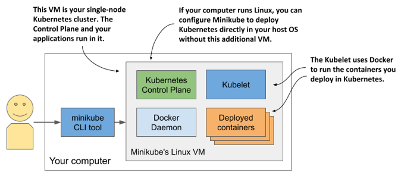

# 3.1.2   Running a local cluster using Minikube

Another way to create a Kubernetes cluster is to use Minikube, a tool maintained by the Kubernetes community. The version of Kubernetes that Minikube deploys is usually more recent than the version deployed by Docker Desktop. The cluster consists of a single node and is suitable for both testing Kubernetes and developing applications locally. It normally runs Kubernetes in a Linux VM, but if your computer is Linux-based, it can also deploy Kubernetes directly in your host OS via Docker.


NOTE

  If you configure Minikube to use a VM, you don’t need Docker, but you do need a hypervisor like VirtualBox. In the other case you need Docker, but not the hypervisor.


## Installing Minikube
Minikube supports macOS, Linux, and Windows. It has a single binary executable file, which you’ll find in the Minikube repository on GitHub (http://github.com/kubernetes/minikube). It’s best to follow the current installation instructions published there, but roughly speaking, you install it as follows.

On macOS you can install it using the Brew Package Manager, on Windows there’s an installer that you can download, and on Linux you can either download  a .deb or .rpm package or simply download the binary file and make it executable with the following command:

```
$ curl -LO https://storage.googleapis.com/minikube/releases/latest/minikube
[CA] -linux-amd64 && sudo install minikube-linux-amd64 /usr/local/bin/mini
[CA] kube
copy
```

For details on your specific OS, please refer to the installation guide online.

## Starting a Kubernetes cluster with Minikube
After Minikube is installed, start the Kubernetes cluster as indicated in the following listing.

```
Listing 3.1 Starting Kubernetes with Minikube
$ minikube start
minikube v1.11.0 on Fedora 31
Using the virtualbox driver based on user configuration
Downloading VM boot image ...
> minikube-v1.11.0.iso.sha256: 65 B / 65 B [-------------] 100.00% ? p/s 0s
> minikube-v1.11.0.iso: 174.99 MiB / 174.99 MiB [] 100.00% 50.16 MiB p/s 4s
Starting control plane node minikube in cluster minikube
Downloading Kubernetes v1.18.3 preload ...
> preloaded-images-k8s-v3-v1.18.3-docker-overlay2-amd64.tar.lz4: 526.01 MiB
Creating virtualbox VM (CPUs=2, Memory=6000MB, Disk=20000MB) ...
Preparing Kubernetes v1.18.3 on Docker 19.03.8 ...
Verifying Kubernetes components...
Enabled addons: default-storageclass, storage-provisioner
Done! kubectl is now configured to use "minikube"
```

The process may take several minutes, because the VM image and the container images of the Kubernetes components must be downloaded.


TIP

If you use Linux, you can reduce the resources required by Minikube by creating the cluster without a VM. Use this command: minikube start --vm-driver none



## Checking Minikube’s status
When the minikube start command is complete, you can check the status of the cluster by running minikube status, as shown in the following listing.

```
Listing 3.2 Checking Minikube’s status
$ minikube status
host: Running
kubelet: Running
apiserver: Running
kubeconfig: Configured
```

The output of the command shows that the Kubernetes host (the VM that hosts Kubernetes) is running, and so are the Kubelet – the agent responsible for managing the node – and the Kubernetes API server. The last line shows that the kubectl command-line tool (CLI) is configured to use the Kubernetes cluster that Minikube has provided. Minikube doesn’t install the CLI tool, but it does create its configuration file. Installation of the CLI tool is explained in section 3.2.

## Visualizing the system
The architecture of the system, which is shown in the next figure, is practically identical to the one in Docker Desktop.
Figure 3.3 Running a single-node Kubernetes cluster using Minikube


The Control Plane components run in containers in the VM or directly in your host OS if you used the --vm-driver none option to create the cluster. The Kubelet runs directly in the VM’s or your host’s operating system. It runs the applications you deploy in the cluster via the Docker Daemon.

You can run minikube ssh to log into the Minikube VM and explore it from inside. For example, you can see what’s running in the VM by running ps aux to list running processes or docker ps to list running containers.


TIP
  If you want to list containers using your local docker CLI instance, as in the case of Docker Desktop, run the following command: 
  `eval $(minikube docker-env)`
  

